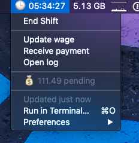

`hours` is a simple command line tool for managing your work hours and the money you make.
  
  - To start a shift, run `hours.py -s`
  - To end a shift, run `hours.py -e`
  - To update your hourly wage, run `hours.py -w`
  - To register a new received payment, run `hours.py -p`
  - To see the current info, run `hours.py -i`

### Running

`hours` is a standalone script that only depends on the Python stdlib. Tested on Python 3.7.2, might work with older versions.

When you run `hours` for the first time, it'll ask you for your current wage as a 1-time setup. After that, it'll start maintaining a log of your shifts and payments in `~/.hours/log.csv`.

### BitBar

`hours` ❤️ [BitBar](https://github.com/matryer/bitbar). For using `hours` as a plugin, simply follow the [BitBar plugin installation guide](https://github.com/matryer/bitbar#installing-plugins).

You can run `hours -b` to see the text output that is compatible with the [BitBar Plugin API](https://github.com/matryer/bitbar#plugin-api). Simply running `hours` without any command line arguments is aliased to `-b`; that's how `hours` works as a plugin without any extra configuration.

 
